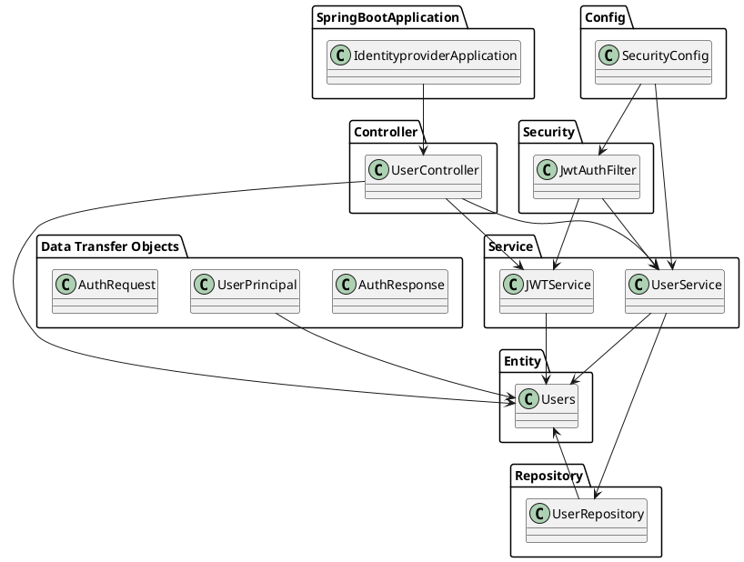

# 📘 AutoDoc Report

## 🧠 Overview

This microservice is primarily focused on authentication and user management. It provides the ability to register and manage users, as well as handle authentication requests. The service leverages Java's Spring Boot, with annotations suggesting the use of a SpringBoot web application, Web Security, and Repositories. 

The service communicates with a database, for storing and retrieving user information, as evident from UserRepository and the Users Entity class. It also implements JWT (JSON Web Token) for authorization, evident from the JWTService class. It may also use an external system for password encoding, likely for storing passwords securely, as indicated by the use of BCryptPasswordEncoder in the UserService class.

Overall, this microservice's responsibilities include user registration, user data management, user authentication, and token generation/validation. It is responsible for validating credentials, generating and validating JWTs, and also providing necessary responses related to these operations.

---

## 🧩 Architecture Diagram

## AuthResponse
## AuthResponse Class Analysis (AD_AuthResponse)

The `AuthResponse` class in the provided Java code appears to be a Data Transfer Object (DTO). This means it's primarily responsible for carrying data between processes. In the case of the given Spring Boot application, this class likely carries data related to authentication responses.

However, the current state of the `AuthResponse` class doesn't provide any fields, methods or annotations. This could mean that it's either not fully implemented yet, or it's used as a marker class for specific operations in the application, potentially related to the authentication process.

The `AuthResponse` class doesn't have any direct connections to other classes in the system based on the provided information. This is quite common for DTOs, as they are generally used to transfer data and don't have much behavior. However, they are typically instantiated and populated by service classes in the application. In this case, it's reasonable to assume that it could be used by the `UserController` or `UserService` classes during the authentication process.

There are no services or layers that depend on `AuthResponse` directly based on the given information, but it's likely that the client-side components of the application depend on it indirectly. They might use the data encapsulated in an `AuthResponse` object to determine the outcome of an authentication request (e.g., whether it was successful, what the authenticated user's roles are, etc.).

The `AuthResponse` class does not play a special role like Entity, Service, AuthProvider, Controller, Utility, or Security as indicated by the `isEntity` and `isRestController` flags in the class summary. Its primary role seems to be a simple DTO for carrying authentication response data.

Overall, the `AuthResponse` class is a part of the system for handling authentication and communicating the results of authentication operations to the client.

---

## UserPrincipal
## Analysis of UserPrincipal Class (AD_UserPrincipal)

The `UserPrincipal` class in this microservice holds the responsibility of serving as a principal object. In Spring Security, the principal object is the currently authenticated user. This class is used to hold the user's authentication and authorization information, including the username, password, and authorities (roles or privileges) of the authenticated user.

The `UserPrincipal` class is directly connected to the `Users` class through its field `user : Users`. It means that an instance of `UserPrincipal` contains user details encapsulated in a `Users` object. The `UserService` class, which is a service layer class responsible for user-related operations, uses this class to load user details based on the username. The `JwtAuthFilter` class also depends on this class to authenticate and authorize the user.

The `UserPrincipal` class implements several methods related to user authentication properties like `getAuthorities()`, `getPassword()`, `getUsername()`, `isAccountNonExpired()`, `isAccountNonLocked()`, `isCredentialsNonExpired()`, and `isEnabled()`. These methods are part of the `UserDetails` interface from Spring Security, which this class must be implementing, although it's not explicitly stated in the summary. These methods enable Spring Security to perform authentication and authorization checks.

Although the `UserPrincipal` class does not have any direct dependencies on other service or repository layers, it plays a crucial role in the security configuration of the application, helping to establish the authenticated user's identity. It does not play any special roles like Entity, Service, AuthProvider, Controller, Utility, or Security. Its primary function is to serve as a principal object in the Spring Security context.

---

## AuthRequest
## Analysis of AuthRequest Class (AD_AuthRequest)

The `AuthRequest` class is a simple data transfer object (DTO) in this microservice. It is used to carry the data for authentication requests, specifically the `username` and `password`.

This class is annotated with `@Data` from the Lombok library, which automatically generates getters, setters, `toString()`, `equals()`, and `hashCode()` methods for the fields in the class. This reduces boilerplate code and improves readability.

The `AuthRequest` class does not appear to have direct connections to other classes based on the provided information. However, considering its role and the conventions of Spring Boot applications, we can infer that objects of this class would be used in the authentication process, likely in the `UserController` and potentially in the `UserService` and `SecurityConfig` classes. It might be used as a parameter in methods that handle login requests, where its `username` and `password` fields would be used to authenticate the user.

As a DTO, the `AuthRequest` class would not have dependencies on services or layers in the system. Instead, it would be used by other classes in the service layer, and possibly the security layer, to transfer the necessary data for authentication requests.

The `AuthRequest` class does not play a special role like an Entity, Service, AuthProvider, Controller, or Utility. It is a simple DTO used to encapsulate and transfer data within the system. However, it is implicitly important in the context of security, as it carries the user credentials required for authentication.

---

## UserRepository
_(AD_UserRepository)_

The `UserRepository` class is a standard Spring Data repository interface in the Identity Provider microservice. Its primary responsibility is to interact with the underlying database layer, performing CRUD operations on `Users` entities.

The repository interfaces in Spring Data are a way to reduce boilerplate code required to interact with the database. The `UserRepository` interface extends Spring Data JPA's `JpaRepository`, providing a range of standard database operations including data retrieval, update, and delete. A custom method `findByUsername(String username)` is declared for fetching `Users` based on the `username`.

This class is annotated with `@Repository`, making it a candidate for Spring's component scanning to detect and automatically import into the container's context for dependency injection.

`UserRepository` is directly linked with the `UserService` and `Users` classes. The `UserService` class calls the methods defined in `UserRepository` to perform database operations on `Users` entities. The `Users` class is an entity representing the `Users` table in the database, and it's the main object handled by `UserRepository`.

Other services or layers that depend on `UserRepository` include the `UserService` class. This service class uses `UserRepository` to fetch user data from the database, and it's where the business logic associated with user operations is implemented.

In terms of special roles, `UserRepository` is not an Entity, Service, AuthProvider, Controller, Utility, or Security class. It is, however, a crucial part of the persistence layer, providing an abstraction over database access and allowing other parts of the application to interact with the `Users` entity without needing to implement database operations directly.

---

## SecurityConfig
_(AD_SecurityConfig)_

The `SecurityConfig` class in this microservice is responsible for configuring the security aspects of the application. It is annotated with `@Configuration` and `@EnableWebSecurity`, which indicates that it is a Spring configuration class, and it will provide security configurations for the application.

This class has three methods:
- `public SecurityFilterChain securityFilterChain(final HttpSecurity http) throws Exception` which likely configures the security filter chain with custom security rules.
- `public AuthenticationManager authenticationManager(final AuthenticationConfiguration authConfig) throws Exception` which probably creates and returns an `AuthenticationManager` bean using the provided `AuthenticationConfiguration`.
- `public AuthenticationProvider authenticationProvider()` which likely creates and returns an `AuthenticationProvider` bean.

The `SecurityConfig` has two fields: `userDetailsService` and `jwtAuthFilter`. They are instances of `UserDetailsService` and `JwtAuthFilter` respectively. These fields suggest that `SecurityConfig` is directly connected to the `UserDetailsService` and `JwtAuthFilter` classes. 

The `UserDetailsService` is typically used for looking up and authenticating users, so it's probable that `SecurityConfig` uses it in its authentication configuration. `JwtAuthFilter`, on the other hand, is likely used to filter and authenticate JWT tokens in the requests coming to the application, so `SecurityConfig` probably uses it in its security filter chain configuration.

As a configuration class, `SecurityConfig` is likely used by the Spring Framework's IoC container to set up the security of the application. Other classes would usually not directly depend on it, but the security settings it configures will indirectly affect how other classes, especially controllers and services, work.

`SecurityConfig` plays a special role as a security configuration provider in the system. It does not fall under the typical roles such as Entity, Service, or Controller, but it is crucial in setting up the application's security settings.

---

## JwtAuthFilter
## Analysis of JwtAuthFilter class (AD_JwtAuthFilter)

The `JwtAuthFilter` class in this microservice is responsible for handling the JWT (JSON Web Token) authorization filter operations during requests. Its main job is to authenticate and authorize requests by verifying the provided JWT tokens, and to manage the user authentication state during the lifecycle of a request.

The `JwtAuthFilter` class is connected to other classes in a number of ways:

- It has dependencies on `JWTService` and `UserService` classes, as indicated by the fields `jwtService : JWTService` and `userService : UserService`. This means that it uses these services to perform operations like validating JWT tokens (`JWTService`) and managing user details (`UserService`).

- It is also connected to the `SecurityConfig` class through a dependency. The `SecurityConfig` class uses the `JwtAuthFilter` for setting up the security filter chain in the Spring Security configuration.

- The `doFilterInternal` method indicates that this class plays an integral role in the filter chain during request processing. In this method, the class likely leverages the `JWTService` to validate the JWT token from the request and the `UserService` to load user details for the authenticated user.

There are several services/layers that depend on `JwtAuthFilter`:

- The `SecurityConfig` class directly depends on `JwtAuthFilter` to set up the security filter chain for the microservice.

- Indirectly, any service or controller that's protected by Spring Security relies on the `JwtAuthFilter` to authenticate and authorize incoming requests.

As for its special role, the `JwtAuthFilter` class is a key component in the security layer of the microservice. It's a custom security filter in the Spring Security filter chain that is responsible for JWT token validation and user authentication. It's annotated with `@Component` indicating that it's a Spring-managed bean and with `@Slf4j` for logging purposes. There's no explicit indication of it being a standard Spring Security filter (like `@Component("springSecurityFilterChain")`), but its role and usage in `SecurityConfig` imply that it's part of the security filter chain.

---

## Users
**(AD_Users)**

The `Users` class serves as an Entity in the microservice. This means that it represents a table in the database, where each instance of the `Users` class represents a row in the table. The `Users` class has fields like `userId`, `username`, and `password`, which correspond to the columns in the `Users` table in the database.

This class carries the `Entity`, `Data`, `Getter`, and `Setter` annotations, indicating that it is a JPA entity with auto-generated getters and setters, and can be used to transfer data within the application.

In the context of the entire system, the `Users` class is used by several other classes:

- `UserPrincipal`: This class has a field of the `Users` type, suggesting that it uses the `Users` class to provide user-related information.
- `UserController`: This class interacts with the `Users` class when registering a new user (`registerUser` method) and when a user attempts to login (`login` method).
- `UserService`: This service class also interacts with the `Users` class to load a user by username and to register a new user.
- `UserRepository`: This class is a Repository that directly interacts with the `Users` entity to perform database operations.
- `JWTService`: This class does not interact directly with the `Users` class. However, since it's involved in the generation, validation, and extraction of usernames from JWT tokens, it indirectly depends on the `Users` class for these operations.

Several layers or services depend on the `Users` class. Specifically, the Controller layer (`UserController`), the Service layer (`UserService`), and the Repository layer (`UserRepository`) have dependencies on it. Also, the `UserPrincipal` class, which seems to be a part of the Security layer, depends on the `Users` class.

Overall, the `Users` class plays an essential role as an Entity in the system, being the representation of the user data in the application. It is the central class around which user-related operations revolve, such as authentication, user registration, and security.

---

## UserController
_(AD_UserController)_

The `UserController` class is a crucial part of this microservice, with its primary responsibility being to handle incoming HTTP requests related to user operations. It is a controller class in the MVC (Model-View-Controller) architecture, which makes it an entry point for handling client requests in the application.

The `UserController` class has three methods: `greet()`, `registerUser()`, and `login()`. These methods correspond to the following endpoints in the application: a `GetMapping` endpoint for `greet`, and two `PostMapping` endpoints for `registerUser` and `login`. 

The `UserController` class is directly connected to the `Users` class, and the service classes `UserService` and `JWTService` through its fields. The `Users` class is an Entity class that represents the user in the application's domain. The `UserService` class provides the business logic related to user operations, and the `JWTService` class is responsible for generating, validating, and extracting usernames from JSON Web Tokens (JWTs). 

The `UserController` class depends on the `UserService` class for user-related operations like loading user details and registering a new user. For authentication-related operations, it relies on the `JWTService`. 

On the other hand, the `IdentityproviderApplication` class, which is the entry point of the Spring Boot Application, depends on the `UserController`. 

The `UserController` class plays a special role as a RestController in the application. It is annotated with `@RestController` and `@RequestMapping`, which means it can handle HTTP requests and map them to specific methods. It is not an Entity, Service, or Utility class, but it is an essential part of the application's security layer as it handles user registration and login. 

The `UserController` class, being a RestController, is an essential class in the Spring Boot Application. It directly interacts with the client-side of the application and handles user-related operations, making it a critical part of the application's security and functionality.

---

## JWTService
## JWTService Analysis (AD_JWTService)

`JWTService` is a key class in the microservice that plays a significant role in the authentication and token management. It is annotated with `@Service` indicating that it's a service layer component in the Spring Framework. 

The responsibilities of the `JWTService` class include:
- Generating JSON Web Tokens (JWT) for authenticated users. This is done in the `generateToken` method which takes a username as an input parameter.
- Validating the JWT to ensure it's not tampered with or expired. This is achieved by the `validateToken` method.
- Extracting the username from the provided JWT. This is done in the `extractUsername` method.

Connections and dependencies with other classes:
- The `JWTService` has a field `secretKey` of type `Key` which is presumably used in the creation and validation of JWTs.
- It is utilized in the `UserController` class for generating and managing JWTs in user authentication and authorization process.
- It is also used by the `JwtAuthFilter` class, a component responsible for filtering and managing HTTP requests in the security context. The `JwtAuthFilter` uses `JWTService` to validate tokens and extract usernames from the incoming requests.

Other services/layers depending on `JWTService`:
- `UserController`: This REST controller depends on `JWTService` for JWT-related operations during user login and registration processes.
- `JwtAuthFilter`: This security filter component uses `JWTService` methods to validate and decode JWTs in HTTP requests.

`JWTService` does not play any special roles like Entity, AuthProvider, Controller, Utility, or Security. Instead, it is a Service layer class that provides business logic related to JWT operations. It is a crucial part of the authentication mechanism of the microservice.

---

## UserService
## Analysis of UserService Class (AD_UserService)

The `UserService` class is a crucial part of this microservice, responsible for handling business logic related to user operations. It is marked with the `@Service` annotation, which indicates that it's a service layer in the Spring Boot architecture.

### Responsibilities and Connections

- The `UserService` class is responsible for loading user details based on the username and registering new users. The `loadUserByUsername` and `register` methods implement these functionalities respectively.

- This class interacts directly with the `UserRepository` class, as indicated by the `userRepository` field. This is a typical pattern in Spring applications, where service classes interact with repositories to fetch and manipulate data.

- Additionally, it uses `BCryptPasswordEncoder` for password encryption, which is essential for secure password handling in user registration.

### Dependencies and Role

- The `UserService` is depended upon by several classes. For instance, the `UserController` class, which handles incoming HTTP requests related to user operations, calls methods from the `UserService` to perform these operations. 

- Moreover, the `JwtAuthFilter` also relies on `UserService` to load user details during the authentication process. 

- The `SecurityConfig` class also uses `UserService` to set the `UserDetailsService` for Spring Security.

In summary, the `UserService` class plays a crucial role in the business logic layer, particularly in operations related to user management. Its functions form a bridge between the data access layer (`UserRepository`) and the web layer (such as `UserController` and `JwtAuthFilter`), facilitating the overall flow of data and operations in the microservice.

---
